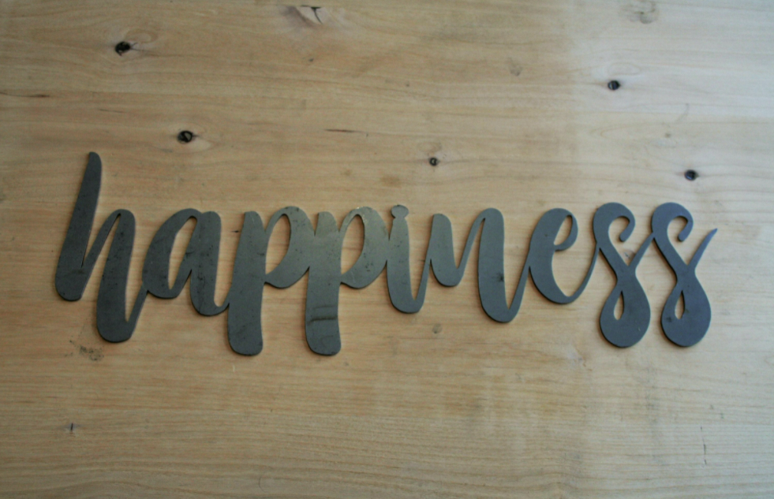

# Group 62- World Happiness Report 2021

- Your title can change over time.

## Milestones

Details for Milestone are available on Canvas (left sidebar, Course Project) or [here](https://firas.moosvi.com/courses/data301/project/milestone01.html).

## Describe your topic/interest in about 150-200 words

The purpose of this analysis is to learn what parameters are used in determining happiness and what can be done to improve overall happiness as well. I intend to discover whether wealthier households are happier than less wealthier ones and vice versa.
I also want to discover what policies have/can be implemented to attain a certain degree of happiness and thier implications.

## Describe your dataset in about 150-200 words

1. Who: The data is provided by Ajaypal Singh, an expert on Kaggle

2. What:  The data constitutes numbers about world happiness. The columns following the happiness score estimate the extent to which each of six factors – economic production, social support, life expectancy, freedom, absence of corruption, and generosity contribute to making life evaluations for each country.

3. When: The data collected is for the year 2021

4. Why:  Happiness indicators describe how measurements of well-being can be used effectively to assess the progress of nations and inform decision making policies for a country.

5. How: The data was collected by a human being and various contributions were made from several individuals in different countries.

## Team Members

- Anita Keto: I enjoy playing video games and building tiny robots

## Images

{You can use this area for any images you want to include}

## References

[Kaggle](https://www.kaggle.com/ajaypalsinghlo/world-happiness-report-2021)

